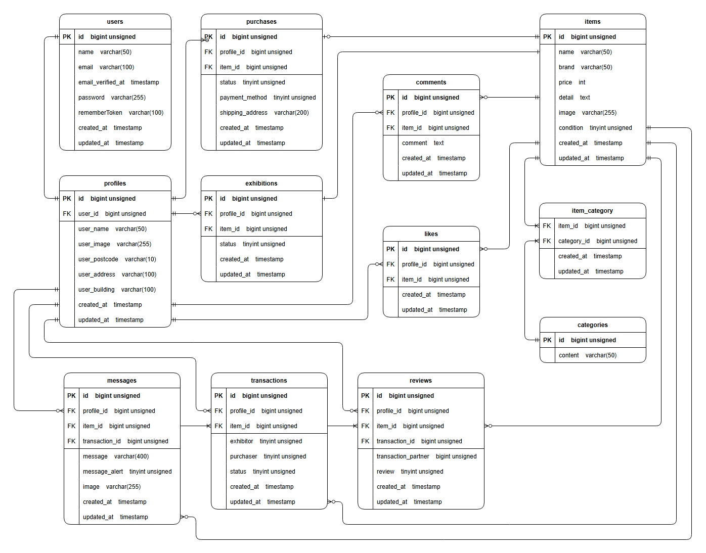

# flea-market-application

## 環境構築

<p>Dockerビルド</p>
<ol>
  <li>git clone https://github.com/Takumi8888/flea-market-application.git</li>
  <li>cd flea-market-application</li>
  <li>git remote set-url origin git@github.com:Takumi8888/flea-market-application</li>
  <li>docker-compose up -d --build</li>
  <li>sudo chmod -R 777 src/*</li>
</ol>

<p>Laravel環境構築</p>
<ol>
  <li>code .</li>
  <li>docker-compose exec php bash</li>
  <li>cp .env.example .env</li>
  <li>chmod 777 .env</li>
  <li>.envファイルの環境変数を変更</li>

```
DB_CONNECTION=mysql
DB_HOST=mysql
DB_PORT=3306
DB_DATABASE=laravel_db
DB_USERNAME=laravel_user
DB_PASSWORD=laravel_pass

MAIL_MAILER=smtp
MAIL_SCHEME=null
MAIL_HOST=mail
MAIL_PORT=1025
MAIL_USERNAME="info@example.com"
MAIL_PASSWORD=null
MAIL_FROM_ADDRESS="info@example.com"
MAIL_FROM_NAME="${APP_NAME}"

STRIPE_PUBLIC_KEY="パブリックキー"
STRIPE_SECRET_KEY="シークレットキー"
```

  <li>composer update</li>
  <li>php artisan key:generate</li>
  <li>php artisan migrate --seed</li>
  <li>php artisan storage:link</li>
</ol>

## Stripeについて
### 支払い方法について
<p>支払い方法は、「コンビニ支払い」と「カード支払い」があります。
<br/>「コンビニ支払い」の場合、レシートを印刷する画面に遷移しますが決済完了は致しません。
<br/>「カード支払い」の場合、カード情報を入力して頂ければ決済完了致します。
<br/>そのため、購入処理に関しては「カード支払い」にて実施して頂けますようお願い致します。</p>

<ul>
  <li>Stripe：<a href="https://dashboard.stripe.com/test/apikeys" target="_blank" rel="noopener noreferrer">https://dashboard.stripe.com/test/apikeys</a></li>
</ul>

## 単体テスト
<p>下記手順にて単体テストを実施（phpコンテナ上にいる場合は、exitしてください）</p>

<p>.env.exampleファイルの環境変数を変更</p>

```
STRIPE_PUBLIC_KEY="パブリックキー"
STRIPE_SECRET_KEY="シークレットキー"
```

<p>MySQLコンテナ</p>

```
docker-compose exec mysql bash

mysql -u root -p
root

CREATE DATABASE demo_test;
SHOW DATABASES;

exit
exit
```

<p>PHPコンテナ</p>

```
docker-compose exec php bash

php artisan config:clear

vendor/bin/phpunit tests/Feature/Auth/RegisterTest.php
vendor/bin/phpunit tests/Feature/Auth/LoginTest.php
vendor/bin/phpunit tests/Feature/CommentTest.php
vendor/bin/phpunit tests/Feature/ExhibitionTest.php
vendor/bin/phpunit tests/Feature/ItemTest.php
vendor/bin/phpunit tests/Feature/LikeTest.php
vendor/bin/phpunit tests/Feature/MyPageTest.php
vendor/bin/phpunit tests/Feature/PurchaseTest.php
vendor/bin/phpunit tests/Feature/TransactionTest.php
```

## 使用技術
<ul>
  <li>PHP 8.2.11</li>
  <li>Laravel 10.48.25</li>
  <li>jquery 3.7.1.min.js</li>
  <li>MySQL 8.0.26</li>
  <li>nginx 1.21.1</li>
  <li>stripe/stripe-php v16.5.1</li>
</ul>

## URL
<ul>
  <li>開発環境：<a href="http://localhost/" target="_blank" rel="noopener noreferrer">http://localhost/</a></li>
  <li>phpMyAdmin：<a href="http://localhost:8080/" target="_blank" rel="noopener noreferrer">http://localhost:8080/</a></li>
  <li>MailHog：<a href="http://localhost:8025/" target="_blank" rel="noopener noreferrer">http://localhost:8025/</a></li>
</ul>

## テーブル仕様
### usersテーブル

| カラム名             | 型                   | primary key | unique key | not null | foreign key      |
| :---                | :---                 | :---:       | :---:      | :---:    | :---             |
| id                  | bigint unsigned      | ○           |            | ○        |                  |
| name                | varchar(50)          |             |            | ○        |                  |
| email               | varchar(100)         |             | ○          | ○        |                  |
| email_verified_at   | timestamp            |             |            |          |                  |
| password            | varchar(255)         |             |            | ○        |                  |
| rememberToken       | varchar(100)         |             |            |          |                  |
| created_at          | timestamp            |             |            |          |                  |
| updated_at          | timestamp            |             |            |          |                  |

### profilesテーブル

| カラム名             | 型                   | primary key | unique key | not null | foreign key      |
| :---                | :---                 | :---:       | :---:      | :---:    | :---             |
| id                  | bigint unsigned      | ○           |            | ○        |                  |
| user_id             | bigint unsigned      |             |            | ○        | users(id)        |
| user_name           | varchar(50)          |             |            | ○        |                  |
| user_image          | varchar(255)         |             |            | ○        |                  |
| user_postcode       | varchar(10)          |             |            | ○        |                  |
| user_address        | varchar(100)         |             |            | ○        |                  |
| user_building       | varchar(100)         |             |            | ○        |                  |
| created_at          | timestamp            |             |            |          |                  |
| updated_at          | timestamp            |             |            |          |                  |

### itemsテーブル

| カラム名             | 型                   | primary key | unique key | not null | foreign key      |
| :---                | :---                 | :---:       | :---:      | :---:    | :---             |
| id                  | bigint unsigned      | ○           |            | ○        |                  |
| name                | varchar(50)          |             |            | ○        |                  |
| brand               | varchar(50)          |             |            | ○        |                  |
| price               | integer              |             |            | ○        |                  |
| detail              | text                 |             |            | ○        |                  |
| image               | varchar(255)         |             |            | ○        |                  |
| condition           | tinyinteger unsigned |             |            | ○        |                  |
| created_at          | timestamp            |             |            |          |                  |
| updated_at          | timestamp            |             |            |          |                  |

### categoriesテーブル

| カラム名             | 型                   | primary key | unique key | not null | foreign key      |
| :---                | :---                 | :---:       | :---:      | :---:    | :---             |
| id                  | bigint unsigned      | ○           |            | ○        |                  |
| content             | varchar(50)          |             |            | ○        |                  |

### item_categoryテーブル

| カラム名             | 型                   | primary key | unique key | not null | foreign key      |
| :---                | :---                 | :---:       | :---:      | :---:    | :---             |
| item_id             | bigint unsigned      |             |            | ○        | items(id)        |
| category_id         | bigint unsigned      |             |            | ○        | categories(id)   |
| created_at          | timestamp            |             |            |          |                  |
| updated_at          | timestamp            |             |            |          |                  |

### likesテーブル

| カラム名             | 型                   | primary key | unique key | not null | foreign key      |
| :---                | :---                 | :---:       | :---:      | :---:    | :---             |
| id                  | bigint unsigned      | ○           |            | ○        |                  |
| profile_id          | bigint unsigned      |             |            | ○        | profiles(id)     |
| item_id             | bigint unsigned      |             |            | ○        | items(id)        |
| created_at          | timestamp            |             |            |          |                  |
| updated_at          | timestamp            |             |            |          |                  |

### commentsテーブル

| カラム名             | 型                   | primary key | unique key | not null | foreign key      |
| :---                | :---                 | :---:       | :---:      | :---:    | :---             |
| id                  | bigint unsigned      | ○           |            | ○        |                  |
| profile_id          | bigint unsigned      |             |            | ○        | profiles(id)     |
| item_id             | bigint unsigned      |             |            | ○        | items(id)        |
| comment             | text                 |             |            | ○        |                  |
| created_at          | timestamp            |             |            |          |                  |
| updated_at          | timestamp            |             |            |          |                  |

### exhibitionsテーブル

| カラム名             | 型                   | primary key | unique key | not null | foreign key      |
| :---                | :---                 | :---:       | :---:      | :---:    | :---             |
| id                  | bigint unsigned      | ○           |            | ○        |                  |
| profile_id          | bigint unsigned      |             |            | ○        | profiles(id)     |
| item_id             | bigint unsigned      |             |            | ○        | items(id)        |
| status              | tinyinteger unsigned |             |            | ○        |                  |
| created_at          | timestamp            |             |            |          |                  |
| updated_at          | timestamp            |             |            |          |                  |

### purchasesテーブル

| カラム名             | 型                   | primary key | unique key | not null | foreign key      |
| :---                | :---                 | :---:       | :---:      | :---:    | :---             |
| id                  | bigint unsigned      | ○           |            | ○        |                  |
| profile_id          | bigint unsigned      |             |            | ○        | profiles(id)     |
| item_id             | bigint unsigned      |             |            | ○        | items(id)        |
| status              | tinyinteger unsigned |             |            | ○        |                  |
| payment_method      | varchar(10)          |             |            | ○        |                  |
| shipping_address    | varchar(200)         |             |            | ○        |                  |
| created_at          | timestamp            |             |            |          |                  |
| updated_at          | timestamp            |             |            |          |                  |

### transactionsテーブル

| カラム名             | 型                   | primary key | unique key | not null | foreign key      |
| :---                | :---                 | :---:       | :---:      | :---:    | :---             |
| id                  | bigint unsigned      | ○           |            | ○        |                  |
| profile_id          | bigint unsigned      |             |            | ○        | profiles(id)     |
| item_id             | bigint unsigned      |             |            | ○        | items(id)        |
| exhibitor           | tinyinteger unsigned |             |            | ○        |                  |
| purchaser           | tinyinteger unsigned |             |            | ○        |                  |
| status              | tinyinteger unsigned |             |            | ○        |                  |
| created_at          | timestamp            |             |            |          |                  |
| updated_at          | timestamp            |             |            |          |                  |

### messagesテーブル

| カラム名             | 型                   | primary key | unique key | not null | foreign key      |
| :---                | :---                 | :---:       | :---:      | :---:    | :---             |
| id                  | bigint unsigned      | ○           |            | ○        |                  |
| profile_id          | bigint unsigned      |             |            | ○        | profiles(id)     |
| item_id             | bigint unsigned      |             |            | ○        | items(id)        |
| transaction_id      | bigint unsigned      |             |            | ○        | transactions(id) |
| message             | varchar(400)         |             |            | ○        |                  |
| message_alert       | tinyinteger unsigned |             |            | ○        |                  |
| image               | varchar(255)         |             |            |          |                  |
| created_at          | timestamp            |             |            |          |                  |
| updated_at          | timestamp            |             |            |          |                  |

### reviewsテーブル

| カラム名             | 型                   | primary key | unique key | not null | foreign key      |
| :---                | :---                 | :---:       | :---:      | :---:    | :---             |
| id                  | bigint unsigned      | ○           |            | ○        |                  |
| profile_id          | bigint unsigned      |             |            | ○        | profiles(id)     |
| item_id             | bigint unsigned      |             |            | ○        | items(id)        |
| transaction_id      | bigint unsigned      |             |            | ○        | transactions(id) |
| transaction_partner | bigint unsigned      |             |            | ○        |                  |
| review              | tinyinteger unsigned |             |            | ○        |                  |
| created_at          | timestamp            |             |            |          |                  |
| updated_at          | timestamp            |             |            |          |                  |

## ER図


## テストアカウント
CO01～CO05の商品を出品したユーザー<br/>
email: reina.n@coachtech.com<br/>
password: password
-------------------------
CO06～CO10の商品を出品したユーザー<br/>
email: taro.y@coachtech.com<br/>
password: password
-------------------------
何も紐づいていないユーザー<br/>
email: issei.m@coachtech.com<br/>
password: password
-------------------------
# flea-market-application
